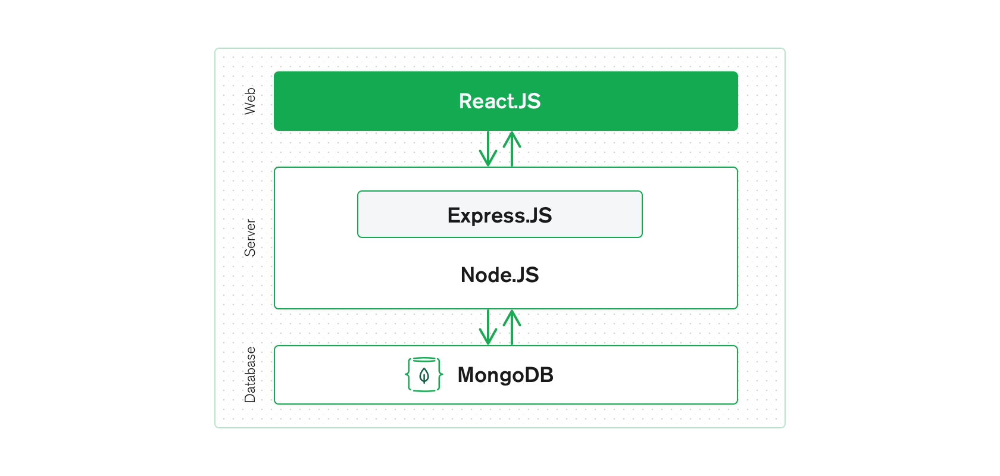

# T3A1 Workbook
### Nicholas Ducker

***


<details>
<summary>Q1</summary>
<br>

  #### Provide an overview and description of a standard source control process for a large project

  Managing a the code of a large scale project is in itself quite a challenging task. Having multiple developers work simultaneously on a code base will inevitably lead to bugs unless each developer explicitly knows what the other developers are doing and how they're doing it. 

  This is where source control steps in. The goal is twofold. Source/version control systems are geared to maintain the integrity of the "Trunk" copy of the project, whilst allowing developers to easily make controlled, reversible, logged changes to the trunk through a variety of different ways.

  For this question, I will describe the Gitflow workflow, which uses Git as its source control system and the Gitflow "wrapper" around the regular Git CLI.
  
  The Gitflow workflow is a great fit for a large project with many developers, as it adds another layer of structure around the "Feature Branching" workflow. In a common feature branching workflow, developers will generally "branch" a copy of the trunk repo onto their machine and work on a new feature. When the new feature is implemented and tested on this branch, the developer then merges is back into the trunk and resolves any conflicts.


  Gitflow breaks these branches up into 5 different types:

  *  Trunk: The stable, released version of the software. There is only one Trunk. Only Hotfix and Develop branches can be branched off this.
  *  Develop: A copy of the Trunk branch. This branch is used to create and integrate Feature branches.
  *  Hotfix: This is the only kind of branch that can be branched off the master more than once. It serves to fix bugs in the current release of the Trunk branch. Any changes here are also pushed into the develop branch.
  *  Feature: The feature branch is branched directly off the Develop branch and is used to add new features to the Develop branch.
  *  Release: The release branch is branched off the Develop branch. Any bug fixes needed are done on this branch before its pushed to the Trunk for release. Any changes here are also merged into the Develop branch.

To further explain this workflow, I've included an diagram below.


In the above diagram, we have a stable v1.0 release of the Trunk (or Master) branch. 

A develop branch is created as a direct copy of the current release of the Trunk branch.

Just below the Trunk a Hotfix branch has been created to fix a bug in the existing production software. When this is completed, it is merged back into the Trunk and the production software is re-released and updated at v1.1. This Hotfix is also merged into the Develop branch and should also be merged into any existing feature branches (this is not illustrated on the diagram). Hotfix branches that are completed are deleted.

A Feature branch has also been created off of the Develop branch and is being worked on. When this is complete and has been tested, it is integrated back into the Develop branch. At this stage, the Develop branch is ready for a release, so a Release branch is created. Feature branches that have been completed are deleted.

The Release branch is independently tested for bugs. Any bug fixes on this branch are merged with the Develop and Feature branches. Once the Release is ready, it is merged into the Trunk branch as the next release, in this case v1.2. It is also finally merged back into the Develop branch and deleted. 

Using this approach to software development. A large project can have multiple teams working independently on many parts of the code base with less risk of conflicts emerging or the code base becoming unstable. 

  <details>
  <summary>Resources</summary>
  <br>

    * https://www.atlassian.com/git/tutorials/comparing-workflows
    * https://www.atlassian.com/git/tutorials/comparing-workflows/gitflow-workflow
    * https://www.youtube.com/watch?reload=9&v=1SXpE08hvGs
    * https://www.campingcoder.com/2018/04/how-to-use-git-flow/
    
  </details>
   
</details>


<details>
<summary>Q2</summary>
<br>

  #### What are the most important aspects of quality software?

  Reliability: Software should reliably give consistently correct output under any condition. Errors that occur in the software have been planned for and are handled. Users should not wonder whether the program is functioning correctly.

  Maintainability: Software should be created and updated in a way that it is easy to maintain. The code base should be written in such a way that it is relatively easy to add new features or tweak existing ones. The maintenance and modification of the program should be thought of in advance and no two elements should be so tightly tied together than one exclusively relies on the other. Points for future new features should be considered from the outset. 

  Usability: The core functionality of the software should be obvious and easy to use. Common use cases should be catered for and made intuitive for users. The software shouldn't need a lot of configuration or intricate setup from the user. Navigation should be obvious and simple. A common design theme should be used throughout the software. 

  Testability: The core functionality of the software should be testable and the results verifiable. The production software will have its own automated testing suite. The tests for the software should be simple, easy to understand and specific. All business use cases should be tested for thoroughly before release. 

  Portability: The software should be flexible in its operating environment. It shouldn't be dependant on a specific operating system or the environment in which it is deployed. The software should be useful across other projects. It shouldn't require lengthy installation processes.

  Efficiency: The software should use the least amount of resources possible to give the desired outputs. This includes CPU usage, the actual power drawn to run the software, external calls to API's and internal calls to a database. It should also be memory efficient and use as little space as possible.

  Security: The software should handle and maintain the integrity of sensitive data in a way that takes into account the sensitivity of that data. The software should manage degrees of accessibility to this information. The software should be able to trace accountability of data access and submission. The software should also track events in relating to security.

  <details>
  <summary>Resources</summary>
  <br>

    *  https://www.silasreinagel.com/blog/2016/11/15/the-seven-aspects-of-software-quality/
    *  http://www.chappellassoc.com/writing/white_papers/The_Three_Aspects_of_Software_Quality_v1.0-Chappell.pdf
    *  https://www.softwaretestinghelp.com/what-are-the-quality-attributes/
    *  https://iso25000.com/index.php/en/iso-25000-standards/iso-25010?limit=3&limitstart=0
    
  </details>
   
</details>


<details>
<summary>Q3</summary>
<br>

  #### Outline a standard high level structure for a MERN stack application and explain the components

  The MERN stack is a term used to describe four different Javascript frameworks. These frameworks in order are Mongo, Express, React and Node. Developers can pull these four frameworks together to look after different "layers" of a web application, giving each layer a fully fledged framework to work off of. This gives developers quite a substantial level of flexibility in how they choose to design their application, and how much data and logic is handled by each technology, and therefore, each layer. 

  

  Mongo: MongoDB is a NoSQL database that stores what Mongo call "Documents", which have a similar format to JSON files. The power of Mongo lies in that it gives developers a lot of flexibility in how they choose to store data akin to what they would find in a JSON file. Mongo interacts with the Express backend framework and acts as the database for the entire application. Express can make calls to MongoDB in order to extract and store needed data.

  Express: Express is a web server framework that is based in Node, which is also another backend framework. It is essentially a framework within a framework. Express allows developers to create flexible, un-opinionated web servers that can flexibly interact with many different technologies. Express is essentially plumbed to provide React with the correct data through routing and calls the the MongoDB database. 

  React: React is a front end framework that allows easy "rendering" of HTML based on a framework handled "state". The implementation of this technology makes it easy to create and maintain a "state", that can be passed from Express via its routing and calls to MongoDB. React also allows for easy creation of dynamic webpages, cutting down the amount of calls that need to be made to the Express server. 

  Node: Node is a server side, lightweight JS environment that allows code to be executed outside of the browser. Express is built and executed within Node, so essentially a web server that is running Node.js is also then running Express through Node. 

  <details>
  <summary>Resources</summary>
  <br>

  * https://www.mongodb.com/mern-stack

    
    
  </details>
   
</details>


<details>
<summary>Q4</summary>
<br>

  #### A team is about to engage in a project, developing a website for a small business. What knowledge and skills would they need in order to develop the project?

  Agile: Using the Agile approach to developing a project, a team can quickly and effectively tackle each stage in of the project in planning phases and sprints, rather than using older, waterfall style methodologies. This allows the team to also effectively communicate throughout the project.

  Planning: A good understanding of a planning approach to use at the start of the project, as well as during the project is integral to developing a project. Using some kind of structure to conceptualise then plan the broad strokes of the project, such as user stories, can help get the idea started. Translating this into an actionable Trello board can help keep the team on task and up to date with the progress of the project as a whole. This also keeps the workload "manageable" as it splits the work into more managable chunks. 

  Communication: Creating a framework around communication between developers and/or teams of developers is integral. This is somewhat addressed by using a methodology like agile to develop. However, conceptually agreeing with that approach to communication is important. Teams should be able to look at communication as a part of their development process and make critical decisions about their approach. 

  Front end: Skills in developing an intuitive and lightweight front end is intrinsic to creating an effective business website. This requires skills in UI and UX design and being able to bring these two visions together to create an excellent front end. The front end should also interact with the back end in an efficient way, passing data only when needed and eager loading what is likely to be used.

  Back end: Developing a effective and relatively lightweight back end is beneficial to all applications. Being intentional around the usage of Express, as it is such an un-opinionated framework. While the flexibility here is a blessing, it is also a curse. Teams can design a functional back end early on in the project, but without proper planning can find themselves consistently finding "workarounds" for new features (or even planned features). Being able to have a long term vision and putting in the foundations for this vision from the outset should be a focus.

  Testing: Thinking about testing from the beginning of the project will allow the team to create a more fleshed out road map for development of the project. Not only that, but they can also test each feature as they go, allowing refinement and tweaking of parts of the project according to shifting needs and vision, without compromising the entire project. Skills in Test Driven Development help create a more robust, functional application from the outset, rather than trying to catch all the bugs towards the end of the project. 

  Deployment: Deployment vision is important to a development of an application. This includes thinking about how much use the application will get, how data intensive it is, what the budget is and designing to this. It also includes thinking about how the application can be scaled, in both directions, in the future. Is the application elastic enough that it can be added to or taken from easily, or does this require a full redesign?

  <details>
  <summary>Resources</summary>
  <br>

    
    
  </details>
   
</details>


<details>
<summary>Q5</summary>
<br>

  #### With reference to one of your own projects, discuss what knowledge or skills were required to complete your project, and to overcome challenges

  Caculocation was a project done for one of the Coder Academy hack-a-thon challenges. It was completed with the help of one other colleague. We only had a three day period in order to take this project from planning to completion, which changed the way we approached the project.

  Planning: As we were operating on such a restricted timeline, we used our knowledge of Trello and splitting projects up into managable chunks from the outset. This looked like drafting our ideas on paper and then essentially breaking them up on Trello as best we could. As the project progressed, we would essentially check in with each other and Trello in order to get a good mental idea of what we needed to be doing each part of each day. 

  Workload management: We used a mixture of Trello and communication to decide the workloads we were both going to take on. For Caculocation, we needed to plumb in a front end mapping API that would interact with the data that Express would pull from Mongo. While this ultimate took less lines of code than the express server itself, we decided that one person would do the "known" coding of creating an Express back end, while the other would try to work out how the mapping API worked and how to the format of the data should look like coming from the back end. This was done in accessory to creating an intuitive, light weight front end.

  API considerations: As a team we had to decide which API we were going to use for mapping, which meant sifting through and somewhat testing API's we thought would work well with our application. Being able to decipher API's and figure out relatively quickly whether we thought they would be good for our purposes was something that drew on all of the skills we had learnt up to that point. I found it actually quite engaging to try and decipher an API in a short amount of time! Taking this to the next level and synthesizing the docs data into a working API on our application was the next level to this process and was equally engaging. 

  UX design: Having a good handle on how the application flowed and its ease of use was also another part of the project that required some forethought and planning. We actually got a bit caught out by this at the end somewhat, as the focus early in the project was simply to make it functional, an MVP. However, I tried to put some though into the UX flow while I was designing the front end from the outset. As the project matured and we got into the final stages, we focused in on the UX to try and deliver a simple, yet polished, application. 

  <details>
  <summary>Resources</summary>
  <br>

    
    
  </details>
   
</details>


<details>
<summary>Q6</summary>
<br>

  #### With reference to one of your own projects, evaluate how effective your knowledge and skills were for this project, and suggest changes or improvements for future projects of a similar nature

  This is written in regards to Caculocation, which is described in the previous question also. 

  More time for UX/UI: Being more intentional about the UI/UX we were going for would have given us a better idea of time we needed to spend on the project, as well as what kind of application we were aiming for. I think we focused in on the MVP features a little too much and forgot to also think about the MVP UI/UX. For a web based application, I think the UI/UX for the core features should be a part of the MVP, as no one will want to interact with even the most functional and effective application if UI and UX has not been taken into consideration. 

  Better planning around time frames: I think this comes with experience, but being able to predict time frames for certain steps/stages of the project is something to work on. With a better sense of what kind of work is needed for certain stage, you're able to know what you'll be able to achieve in a certain time frame. It also gives more structure around communication and checking in at certain times. With this project, I think we aimed somewhat low, as there were some unknowns in the picture, but certainly learnt a lot around this. 

  Research before planning phase: This ties into the above point. Doing research with API's, experimenting with building Express Servers from scratch and thinking about MongoDB schemas before the actual project, or as part of the research before the planning of the project can save time and energy. Essentially this time and energy is being put in anyway, just earlier, but it allows us to get a better understanding of a technology/API from a zoomed out perspective, before we hone in and decide this is what we're going to use in this particular way.

  More thought around how to couple a back and front end: A roadblock to this project was not understanding exactly how the mapping API functioned when we started the project, which ties back to the above point also. Looking back, I now know that most mapping API's require a lat/long in order to map a point and can return lat/longs from the actual map. Even this small bit of knowledge would have changed the way I initially approached planning how to connect back and front end. Being quite intentional about this in the future allows early planning and implementation around the predicted model. It also would allow for easier testing from the outset. In fact, testing probably would force this process a bit more, as you would have to think about what is moving between the front and the back end before writing any code whatsoever. 

  <details>
  <summary>Resources</summary>
  <br>

    
    
  </details>
   
</details>


<details>
<summary>Q7</summary>
<br>

  #### Explain control flow, using an example from the JavaScript programming language

  Control flow is the order in which a language will run statements in a file of code. Generally speaking, a computer will run code, line by line, executing each command/statement as it comes along it. Control flow allows programmers to influence what is executed depending on conditional statements. This conceptually can be boiled down to if x, then do y. Javascript gives programmers a few different options in control flow.

  ```
  // The if statement is one of the most basic control flow expressions available
  // if the conditional evaluates to true, the code inside the block will run. 
  // Optionally, an else if statement can be used to check another conditional. 
  // Lastly, an else statement can be added that will run if all conditionals resolve to false.

  if (conditional == true) {
    functionOne()
  } else if (otherConditional == true) {
    functionTwo()
  } else {
    functionThree()
  }

  // A switch statement can check a conditional against many "cases". If the conditional evaluates true to a case, then that block of code is run.
  // As this switch statement is not returning anything and is working on side effects, we must use a break statement to exit the switch once a case is matched.

  switch(number) {
    case 1:
      console.log('numero uno');
      break;
    case 2:
      console.log('one more than one');
      break;
  }

  // While loops will continue to run while the conditional passed to them is evaluated as true. It will run the code block, check the conditional and then run until the conditional returns false.

  let running = true
  let number = 0

  while(running) {
    number++
    running = (number === 5) ? false : true
  }
  ```

  There are several other loop options in JS, including do while, for, for of, for await of and for in, which all work off the same basic principle of checking some conditional that will break the loop.

  <details>
  <summary>Resources</summary>
  <br>
  *  https://developer.mozilla.org/en-US/docs/Glossary/Control_flow
  *  https://exploringjs.com/impatient-js/ch_control-flow.html
    
    
  </details>
   
</details>


<details>
<summary>Q8</summary>
<br>

  #### Explain type coercion, using examples from the JavaScript programming language

  Type coercion is the implicit conversion of a value from one data type to another. For example, changing the string '1' to the integer 1 would be an example of Type coercion or type conversion. What separates conversion from coercion is that when we type convert, we are explicit in what kind of data type we want the compiler to read. Type coercion leaves this decision up to the compiler depending on the input.

  ```
  // two examples of type coercion

  // Here, the compiler coerces the second variable, val2, into a string when added to val1
  const val1 = "3"
  const val2 = 4
  const result = val1 + val2

  console.log(result) // '34'

  //If we use the minus operator, then the compiler will try to coerce the string into an integer
  const val1 = "3"
  const val2 = 4
  const result = val1 + val2

  console.log(result) // -1
  ``` 

  // Type conversion is when we are explicit in how we want the compiler to convert a value.
  // In this example, we tell the computer we wish val1 to be coverted to a number before addition

  const val1 = "3"
  const val2 = 4
  const result = Number(val1) + val2

  console.log(result) // 7

  <details>
  <summary>Resources</summary>
  <br>
  https://developer.mozilla.org/en-US/docs/Glossary/Type_coercion
    
    
  </details>
   
</details>


<details>
<summary>Q9</summary>
<br>

  #### Explain data types, using examples from the JavaScript programming language

  Data types are, simply put, the different types of data a programming language can manipulate. Many of these types are common across most languages, but the way an language interacts with a data type can differ. JS recognizes six different data types:

  *  undefined
  *  Boolean
  *  Number
  *  String
  *  BigInt
  *  Symbol

```
  // Undefined is the data type of a variable that has not had anything assigned to it yet. JS first creates its variables, then assigns them a value if one has been provided. Until this is done, a variable will return undefined

  let var1
  console.log(var1) // => undefined

  // A Boolean is a simple true, or false, that will be evaluated as such by the compiler.

  let num = 4
  let isItFive = (num === 5)
  console.log(typeof isItFive) // => boolean

  // A number is any number that falls within -(2 ** 53 − 1) and 2 ** 53 − 1. This is inclusive of floats also, which can be differentiated in other programming languages. Numbers larger or smaller than these maximums are unsafe. BigInts should be used instead outside of these ranges. A BigInt can be defined by using an n at the end of a number

  let smallNum = 10
  let bigNum = 10n

  console.log(typeof smallNum) // => number
  console.log(typeof bigNum) // => bigint

  // A string is essentially a collection of elements that take up space in somewhat of an array. Each character has its own positions, starting from index 0. 

  let greeting = "Hello there"

  console.log(typeof greeting) // => string
  console.log(greeting[1]) // => 'e'

```

  <details>
  <summary>Resources</summary>
  <br>
  https://developer.mozilla.org/en-US/docs/Web/JavaScript/Data_structures
    
    
  </details>
   
</details>


<details>
<summary>Q10</summary>
<br>

  #### Explain how arrays can be manipulated in JavaScript, using examples from the JavaScript programming language

  Arrays allow programmers to store a group of different data types into one single variable that can be operated on and manipulated. Generally there is some reason or commonality to the data that is stored. Programmers can add and remove items to the array, as well as iterate over that array in different ways, or pull single elements from the array. Below are some common manipulations of an array

  ```
    // Here we define an array of 4 elements, each element being a number from 1 to 4
    let array = [1,2,3,4]

    // We can call back a specific element in the array by asking for its index
    console.log(array[1]) // => 2

    // We can add an item to the end or start of an array by using push or unshift respectively
    array.push('five')
    array.unshift('zero')

    console.log(array) // => ['zero', 1, 2, 3, 4,'five']

    // We can also remove the first element from the start or the end using shift and pop respectively
    array.shift()
    array.pop()

    console.log(array) // => [1,2,3,4]

    // We can loop through the elements in an array and execute a code block for each element using for each

    let elementCount = 0
    array.forEach((element) => {
      elementCount += element
    })

    console.log(elementCount) // => 10

    // We can use map to return an array of elements that have had some work done to each element

    let newArray = array.map((element) => {
      return element * 2
    })

    console.log(newArray) // => [2, 4, 6, 8]

    // We can use filter to return a list of elements that evaluate true according to a provided conditional

    let selection = array.filter((element) => {
      return element >= 3
    })

    console.log(selection) // => [3, 4]

    // We can remove items from an array using splice
    let removed = array.splice(1,2) // Here we remove two numbers from the array, starting from index 1. The removed elements are returned

    console.log(removed) // => [2,3]
    console.log(array) // => [1,4]
  ```

  <details>
  <summary>Resources</summary>
  <br>
  https://developer.mozilla.org/en-US/docs/Web/JavaScript/Reference/Global_Objects/Array
    
    
  </details>
   
</details>


<details>
<summary>Q11</summary>
<br>

  #### Explain how objects can be manipulated in JavaScript, using examples from the JavaScript programming language

  <details>
  <summary>Resources</summary>
  <br>
  https://developer.mozilla.org/en-US/docs/Web/JavaScript/Reference/Global_Objects/Object
    
    
  </details>
   
</details>


<details>
<summary>Q12</summary>
<br>

  #### Explain how JSON can be manipulated in JavaScript, using examples from the JavaScript programming language

  <details>
  <summary>Resources</summary>
  <br>
  https://developer.mozilla.org/en-US/docs/Web/JavaScript/Reference/Global_Objects/JSON
    
    
  </details>
   
</details>


<details>
<summary>Q13</summary>
<br>

  #### For the code snippet provided below, write comments for each line of code to explain its functionality. In your comments you must demonstrates your ability to recognise and identify functions, ranges and classes

  ```
  class Car {
    constructor(brand) {
        this.carname = brand;
      }
      present() {
        return 'I have a ' + this.carname;
      }
    }

    class Model extends Car {
      constructor(brand, mod) {
        super(brand);
      this.model = mod;
    }
      show() {
        return this.present() + ', it was made in ' + this.model;
      }
    }

    let makes = ["Ford", "Holden", "Toyota"]
    let models = Array.from(new Array(40), (x,i) => i + 1980)

    function randomIntFromInterval(min,max) { // min and max included
      return Math.floor(Math.random()*(max-min+1)+min);
    }

    for (model of models) {

    make = makes[randomIntFromInterval(0,makes.length-1)]
    model = models[randomIntFromInterval(0,makes.length-1)]
       
    mycar = new Model(make, model);
    console.log(mycar.show())
  }


  ```

  <details>
  <summary>Resources</summary>
  <br>

    
    
  </details>
   
</details>
